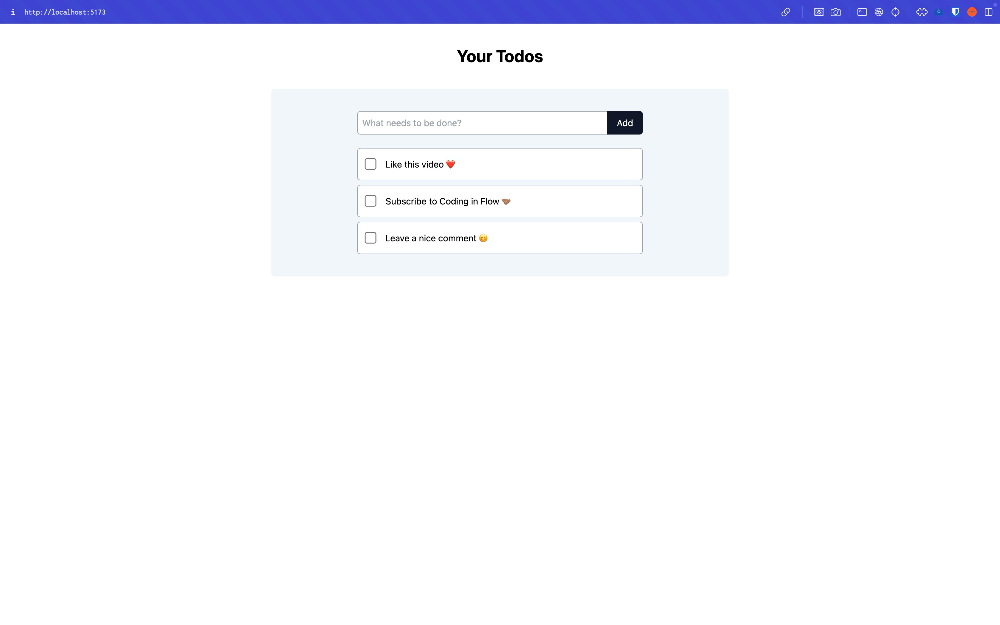

# Simple Todo List App with CRUD Functionality

🔥 A basic yet functional Todo List application built with React, implementing CRUD operations while exploring key React concepts.

---

## Day 1 - #D1

### Key Learnings:

🔥

- **useState Hook**: Used to manage the state of the application.
- **Form Keypress Event**: Enabled dynamic input handling for the creation of todos.

### Features Implemented:

- Basic UI setup.
- Displaying tasks dynamically.
- Creation of new tasks.

---

## Day 2 - #D2

### Demo:

[Screen Recording](./public/assets/videos/Todo%20List%20Screen%20Recording.mp4)

### Key Learnings:

🔥

- **Conditional Rendering**: Displaying different content based on the application state.
- **Parent-Child Communication**:
  - Passing props from parent to child for displaying items.
  - Callback functions for making changes from child to parent.
- **useEffect Hook**: Managing side effects with dependencies.
- **Custom Hook (`useTodos`)**: Encapsulating logic for better reusability and separation of concerns.

### Features Implemented:

- Deletion of todo items.
- Sorting of todos based on their completion status.
- Filtering and displaying tasks conditionally.

---

## Future Enhancements

- Edit functionality for existing tasks.
- Integration with a backend to persist data.
- Adding due dates and priority levels for todos.

---

### Tech Stack:

- **Frontend**: React, TailwindCSS.
- **Custom Hooks**: For state management and logic encapsulation.

---

💡 This project is a learning exercise to build a robust understanding of React fundamentals while creating a functional app.
