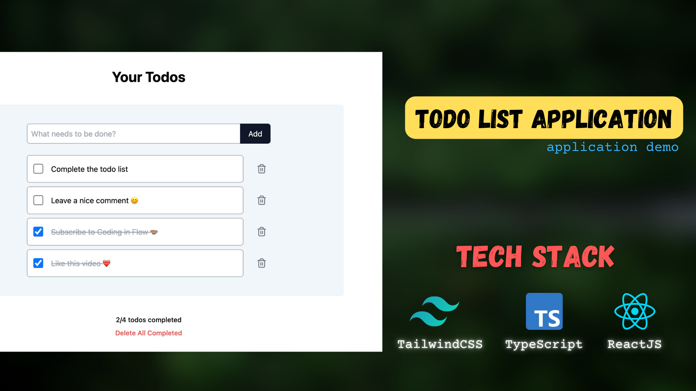

# Todo List App

🔥 A simple Todo List app with CRUD functionality.


---

## Day 1: Basic Setup and Features


🔥 **What was accomplished:**

- Learned the `useState` Hook.
- Implemented a basic UI.
- Added functionality to display tasks.
- Implemented the creation of tasks using a form and keypress events.

---

## Day 2: Advanced Features

https://github.com/user-attachments/assets/b414163c-aff5-4bf3-91e5-5872399de79f

🔥 **What was accomplished:**

- Implemented conditional rendering.
- Added functionality for filtering tasks.
- RULE: Displaying items in children → passing props from parent to child & making changes from child to parent → Callback functions.
- Used the `useEffect` hook with dependencies.
- Created custom hooks: `useTodos`.
- Implemented deletion of todo items.
- Sorted todos based on completion status.

---

## Features

- Create, Read, Update, and Delete (CRUD) functionality.
- Dynamic input handling and real-time task updates.
- Custom hooks for managing state efficiently.
- Clean and intuitive UI design.

---

## How to Run the Project

1. Clone the repository:
   ```bash
   git clone https://github.com/isamanverma/todoList.git
   ```
